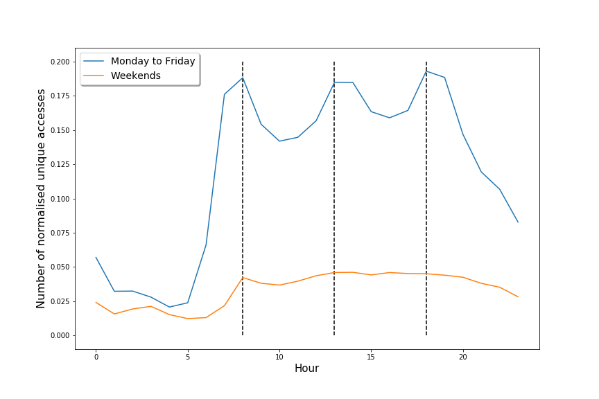

% **Socio-Economic Factors\
	in the Consumption of Online News**
% **Leo Ferres**\
  UDD & Telefónica R+D, Chile\
  `lferres@udd.cl`\
  FB, IG, Tw, GH: @leoferres\
  (with S Vilella, G Ruffo, and D Paolotti)
% SECS19 (!\scriptsize It's so hard to explain this to funders...)\
	Lipari, Italy, July 13-18 2019\
	\tiny s:2019-06-16 13:13:53 -0400 - e:2019-07-16 04:37:25 -0400 \normalsize

# Intro

**Goal**: studying geo-located accesses to news media websites at
finer levels of granularity from areas of different socio-demographic
features.

**Research question**: \textcolor[rgb]{0.0,0.0,1.0}{Does reading grow
linearly with HDI?}

# Intro

**Goal**: studying geo-located accesses to news media websites at
finer levels of granularity from areas of different socio-demographic
features.

**Research question**:

- \textcolor[rgb]{0.0,0.0,1.0}{Does reading grow linearly with
socio-economic status?}
- \textcolor[rgb]{0.0,0.0,1.0}{Do people of different socio-econ read
varied content?}

**WHY**: To fight misinformation (systemic pov)

# (Some) grounding in theory

{width=50%}

# Geo

- Santiago de Chile, founded in 1541, ~7M people, ~840Km2

{
width=93% }

# The Chilean news system

- Concentrated ownership\footnote{\tiny Bahamonde, Bollen, Elejalde, Ferres,
  Poblete (2018) Power structure in Chilean news media. PLoS ONE
  13(6): e0197150.}

{ height=70% }

# The Chilean news system

- Low diversity\footnote{\tiny Elejalde, Ferres, Herder,
  Bollen. (2018). Quantifying the ecological diversity and health of
  online news. Journal of Computational Science 27, 218–226}

# The Chilean news system

- Liberal bias\footnote{\tiny Elejalde, Ferres, Herder
  (2018) On the nature of real and perceived bias in the mainstream
  media. PLoS ONE 13(3): e0193765}

{ height=70% }

# All focusing on the *contents* of tweets, except:

- Some target socio-econ groups\footnote{\tiny
  Elejalde, Ferres, Schifanella. (2019). Understanding News Outlets'
  Audience-Targeting Patterns. EPJ Data Science, 8: 16. - \tiny{!A
  feeble attempt at self-promotion}}

{ height=30% }

{height=60%}

# However...

- tweeters hard to locate (~1\%) -> too coarse (comuna)

# But then...

I moved jobs to Telefónica... >:)

# Mobile data

Given

- $>$ 52% of web traffic generated by mobile phones (2018),
- high penetration of cellphones in Chile (1.3/person),
- computational power for analysis of VLDBs (1TB, 2B rows/3 months
  *only calls*),
- no rough IPs anymore... geoloc at the level of tower,
- real-time, large-scale, fine-grained datasets

resulted in

- renewed interest in ``individual'' human behavior,
- using pings to tackle important social issues, e.g.
  - gender
  - segregation and poverty
  - use of public spaces
  - **information consumption**

# Prelims: geo & towers

{ width=70% }\ {height=50%}

# Prelims: geo & partitioning space

{width=70%}

# Prelims: telephony

- **CDR** (**C**all **D**etail **R**ecord) a tuple $\langle n_a, n_b,
  t_a, t_b, d, r\rangle$ (used mainly for billing minutes, sparse in
  time, coarse in space)\footnote{\tiny Tizzoni {\em et al.} Gender gaps in
  urban mobility. \url{https://arxiv.org/abs/1906.09092}}

- **XDR** (e**X**tended **D**etail **R**ecord) a tuple $\langle n_a,
  t_a, d, k\rangle$ (used mainly for billing data usage, dense(r) in
  time, coarse in space)\footnote{\tiny Graells-Garrido, Ferres, Caro and
  Bravo. (2017) The effect of Pokémon Go on the pulse of the city: a
  natural experiment. EPJ Data Science2017
  6:23}\textsuperscript{,}\footnote{\tiny Beiró, Bravo, Caro, Cattuto,
  Ferres and Graells-Garrido. (2018). Shopping mall attraction and
  social mixing at a city scale. EPJ Data Science2018 7:28}

- **DPI** (**D**eep **P**acket **I**nspection, or User Control Plane) a
  tuple $\langle n_a, t_a, d, k, p\rangle$, used for data bandwidth
  allocation

- **CP** (**C**ontrol **P**lane), used for network ``health''
  monitoring, not persisted, network events like handovers, shakes,
  etc.

# Datasets

- DPI:
	- July 2016
	- IP addresses of 27 news media outlets, for most of which we know
  their political alignment and ownership structure
\begin{table}[h]
	\scriptsize
	\begin{tabular}{lllllr}
		&antenna&date&hour&ip&usrs\\
		1&00000000 & 20160706 &11 & 200.12.26.117&1\\
		2&00000000&20160706&14&190.153.242.131&1\\
		3&00000000&20160706&14&200.12.20.11&1\\
		4&00000000&20160706&15&190.110.123.219&1\\
		... &... &... &... &... & ...
	\end{tabular}
\end{table}

- The 2017 census (17m people, blocks)

# Outlets

\begin{table}[h]
	\begin{tabular}{c}
		BioBioChile                                \\
		El Mercurio editorial group                \\
		Cooperativa                                \\
		AdnRadioChile                              \\
		The Clinic                                 \\
		Tele 13                                    \\
		Publimetro Chile                           \\
		Diario Financiero                          \\
	\end{tabular}
\end{table}

# HDI

{ width=110% }

# Clustering census districts

{ width=60% }\ {width=40% }

\begin{table}
\tiny
	\begin{tabular}{ccccc}
		\hline
		\textbf{Cluster} &   Mean age & Avg years of schooling & \% of students & \% of people of indigenous ethnicity \\
		\hline
		\textbf{K1} &       46.25 &       16.91 &        0.15 &        0.05 \\
		\textbf{K2} &       38.78 &       16.50 &        0.18 &        0.07 \\
		\textbf{K3} &       42.05 &       14.65 &        0.14 &        0.10 \\
		\textbf{K4} &       46.36 &       14.30 &        0.12 &        0.10 \\
		\textbf{K5} &       44.62 &       12.86 &        0.11 &        0.13 \\
		\hline
	\end{tabular}
\end{table}

# General results

- Connections during the weekend

# General results

{width=90%}

- Young and educated read significantly more than other groups

# General results

{width=90%}

- K3 more educated than K4, K5 (lot more!), but read less

# Specific results
{height=70%}

- Young and educated read more varied content

# Specific results
{height=70%}

- K1 is restricted to particular (conservative, !capitalist) outlets

# Specific results
{height=70%}

- K3 still at the bottom

# General conclusions

- News consumption follows the the rhythms of daily life
- Socio-demographics play a key role (education and age)

In particular, going back to the hypothesis:

- Linearity between K does not hold

# Future work

- A DPI dataset of "hits" \scriptsize (!Talk to Salvatore :)\normalsize
- Cross CDR/XDR data?
- Biasing factors
  - Non-traditional datasets

# Thank you!

## Collaborators

\scriptsize
Loreto Bravo (IDS, UDD & Telefonica), Eduardo Graells
(IDS, UDD & Telefonica), Diego Caro (IDS, UDD & Telefonica), Daniela
Opitz (IDS, UDD & Telefonica), Fran Varela (IDS, UDD & Telefonica),
Pablo García (BCI), Eric Ancelovici (Telefónica), Manuel Sacasa
(Telefónica), Andrés Leiva (Telefónica), Ciro Cattuto (ISI
Foundation), Daniela Paolotti (ISI Foundation), Laetitia Gauvin (ISI
Foundation), Michele Tizzoni (ISI Foundation), Johan Bollen (Indiana
University), Rossano Schifanella (U Torino), Giancarlo Ruffo (U
Torino), Erick Elejalde (L3S, Germany), Markus Strohmeier (Aachen,
Germany), Eelco Herder (Radboud, The Netherlands), Bruno Goncalves (JP
Morgan, USA), Stefaan Verhulst (NYU, USA), Natalia Adler (UNICEF,
USA), Ricardo Baeza-Yates (Northeastern@Silicon Valley), Salvatore
Vilella (ISI, UTorino), Meng He (Dalhousie, Canada), Travis Gagie
(Dalhousie, Canada), Norbert Zhe (Dalhousie, Canada), Mariano Beiró
(UBA, Argentina), André Panisson (ISI Foundation), Michel Dumontier
(Maastricht, The Netherlands), Karim Touma (Falabella)
\normalsize

# Privacy considerations

It's a common question:

- No users,
- aggregated by hour,
- towers are aggregated at the 1Km2 level,
- data do not leave TEF servers (except at very high levels of
  aggregation),
- We **do not** report on (or care about, really) individuals (only
  aggregations).

BUT...

# Privacy considerations

The **\textcolor[rgb]{1.0,0.0,0.0}{uncommon}** question is the
following:

- what are the social costs of **not** doing these studies?
